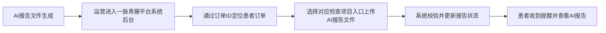

# AI报告上传需求分析

## 一、当前阶段说明

本需求目前处于分析起步阶段，以下内容以“先澄清问题、再沉淀分析”的方式推进。

当前已知信息：

- 需求专题名称为“AI报告上传”。
- 已确认部分关键事实，包括上传角色、上传后台、上传样例文件以及订单匹配方式。

分析原则：

- 没有确认的信息，一律标记为“待确认”。
- 先明确业务问题，再讨论页面、字段和交互。

## 二、先回答的 5 个关键问题

这 5 个问题确定后，才能进入正式分析。

1. 这个需求主要是给谁用的？
2. 这里的“AI报告”具体指什么内容？
3. 为什么要“上传”，而不是系统自动生成或自动同步？
4. 上传动作发生在什么业务节点？
5. 上传完成后，谁会查看、使用、审核或继续处理？

## 三、需求背景

### 3.1 当前已知

- 已存在 AI 产品上架与推荐链路，上游设计图已补充到 `analysis/AI报告商品上架配置方案设计图/`。
- 现有上游方案中，AI 能力并不是独立凭空出现，而是先作为“AI产品”在后台完成配置、上架与项目关联，再在医生开单页向患者推荐。
- 患者侧已存在与 AI 报告相关的商品展示、支付购买、报告列表与报告详情页设计。
- 流程图中已明确出现“AI分析检查生成AI报告文件，手动在后台AI报告上传”这一节点，说明当前链路里 AI 报告生成后，仍依赖人工上传动作完成患者可见结果闭环。
- 已确认 AI 报告由运营人员上传。
- 已确认上传入口位于一脉青藤平台系统后台，对应设计参考位于 `analysis/AI报告商品上架配置方案设计图/AI产品后台配置方案/`。
- 已确认上传内容为 AI 报告分析文件，当前样例文件已归档到 `analysis/AI报告样例文件/AI报告分析文件示例-冠脉钙化积分.png`。
- 已确认上传时会先展示患者订单列表，通过订单 ID 查找目标订单；当一个订单下存在多个检查项目时，再上传到对应的检查项目入口。

### 3.2 需要补齐

- 业务背景：为什么现在要做这个需求
- 当前问题：没有该能力时，卡在哪个环节
- 不做影响：如果不做，会影响谁、影响什么指标

## 四、目标确认

### 4.1 业务目标

- 待确认

### 4.2 用户目标

- 待确认

### 4.3 非目标

- 待确认

## 五、角色与场景

### 5.1 涉及角色

- 运营：负责新建 AI 产品并维护基础信息。
- 专家：负责将 AI 产品关联到平台项目。
- 医生：在开单页勾选并推荐 AI 产品服务给患者。
- 患者：支付订单、完成检查、在“我的报告”中查看 AI 报告。
- 运营人员：在一脉青藤平台系统后台执行 AI 报告上传。

### 5.2 典型场景

- 运营在后台新增 AI 产品，填写产品名称、编码、分类、适用检查类型、售价、封面图、推荐理由与上架状态。
- 专家在 AI 产品关联配置页，将 AI 产品与平台检查项目建立关联关系。
- 医生在开单页为患者勾选“AI报告分析推荐”服务。
- 患者在订单详情页看到 AI 报告推荐内容，并与检查服务一起支付。
- 患者完成线下检查后，系统或外部能力生成 AI 报告分析文件。
- 运营人员进入一脉青藤平台系统后台，在患者订单列表中通过订单 ID 查找目标订单。
- 当一个订单下有多个检查项目时，运营人员进入对应检查项目入口上传 AI 报告分析文件。
- 上传完成后，患者收到提醒并在“我的报告”中查看普通报告和 AI 产品报告服务。

### 5.3 核心问题

- AI 报告上传是当前链路中的关键闭环节点，但目前只在流程图中体现为“手动后台上传”，缺少明确的业务规则、页面方案和操作边界。
- 当前已明确由运营人员上传，并通过订单 ID 找到目标订单后进入对应检查项目入口。
- 仍需继续明确报告文件格式要求、是否允许重复上传/覆盖上传、上传成功后的状态与通知规则。

## 六、流程分析

### 6.1 现状流程

根据现有设计图，可推导出当前上游现状流程如下：

从当前材料可看到：

- 后台已具备 AI 产品管理能力，包括新增、启停、编辑与“配置项目”入口。
- 后台已具备 AI 产品与平台项目的关联配置能力，可按检查类型、部位、项目进行筛选与批量关联。
- 患者端已具备 AI 报告商品展示、订单支付、我的报告列表、已出报告详情等承接页面。
- 当前最不清晰的环节正是 `F -> G`，即 AI 报告文件生成后，如何进入业务系统并成功对患者可见。

### 6.2 目标流程

目标流程待在本需求中重点补齐，尤其是“AI 报告上传”所在节点的业务闭环。

当前建议把目标流程优先聚焦在以下问题：

- 上传文件格式和命名规则
- 如何在订单列表中快速找到目标订单
- 一个订单多个检查项目时如何选择正确入口
- 上传成功后患者侧如何变更状态并收到通知
- 是否允许重新上传、覆盖上传或驳回

## 七、功能拆解

### 7.1 可能涉及的能力

- 上传入口：在一脉青藤平台系统后台补齐或明确 AI 报告上传入口
- 订单定位能力：在患者订单列表中通过订单 ID 快速查找目标订单
- 项目级上传能力：当订单下有多个检查项目时，支持进入对应项目入口上传
- 文件/内容校验：校验 AI 报告分析文件格式、大小、命名、必填关联信息
- 关联能力：基于订单 ID 与检查项目完成患者、订单、项目、AI 服务之间的绑定
- 上传后状态反馈：报告状态更新、患者侧列表展示、短信或站内提醒
- 查看与处理：后台查看上传记录、关联结果与处理状态
- 审核或确认：是否需要二次审核待确认
- 异常处理：上传失败、关联失败、重复上传、错误报告替换等

### 7.2 暂不展开的内容

- AI 产品新增、商品上架和患者端购买链路，本需求中视为已存在上游能力，默认不重做
- AI 算法本身如何生成报告内容，当前先视为外部已存在能力

## 八、关键规则

### 8.1 上传对象

- 当前已确认为 AI 报告分析文件
- 文件格式、大小限制、命名规则待确认

### 8.2 上传时机

- 当前推断为患者完成线下检查且 AI 报告生成后再上传
- 是否必须在普通报告出具后才能上传，待确认

### 8.3 状态流转

- 患者端当前已存在“未出报告 / 已出报告”状态感知
- AI 报告上传是否单独维护上传状态、审核状态、展示状态，待确认

### 8.4 权限边界

- 当前已确认为运营人员在一脉青藤平台系统后台上传
- 待确认：谁可查看、修改、重新上传、删除

### 8.5 异常场景

- AI 报告生成成功但上传失败
- 上传文件与订单/患者关联错误
- 同一订单下项目选错，上传到了错误检查项目
- 患者已查看后报告被替换
- 重复上传同一份报告
- 患者未购买 AI 服务但误上传 AI 报告

## 九、待确认问题

| 序号 | 待确认问题 | 当前状态 |
|------|------------|----------|
| 1 | 上传后是否需要审核、确认、回退或重新上传 | 待确认 |
| 2 | 上传完成后，结果给谁看，用于展示、结算、归档，还是后续任务流转 | 待确认 |
| 3 | AI 报告文件支持哪些格式、大小限制和命名规范 | 待确认 |
| 4 | 上传时除了订单 ID 外，是否还需要校验患者姓名、检查时间、影像号等辅助信息 | 待确认 |
| 5 | 普通报告和 AI 报告的先后关系、展示关系、通知关系是否有固定规则 | 待确认 |
| 6 | 一个订单下多个检查项目时，系统如何避免运营误传到错误项目 | 待确认 |
| 7 | 已上传的 AI 报告是否允许替换，替换后是否需要留痕 | 待确认 |
