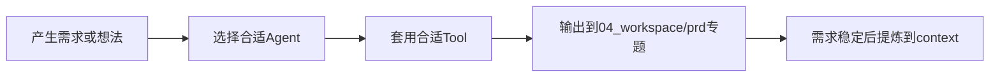

# PM能力层赋能建设 - 需求分析

本分析文档对应以下 agent 与 tool：

- Agent：`01_agents/角色定义/产品策略顾问.md`
- Agent：`01_agents/角色定义/需求分析师.md`
- Tool：`02_tools/模板/需求分析输入卡.md`

## 1. 需求背景

`pm_agent` 当前已经具备比较清晰的知识分层：

- `05_drafts/` 负责临时探索
- `04_workspace/` 负责进行中工作
- `03_context/` 负责稳定知识

这解决了“内容放哪里”的问题，但还没有系统解决“AI 应该怎么做事”的问题。

因此，当前真正缺的不是再建一套新的 `03_context/workspace`，而是补齐两层能力：

- `01_agents/`：定义角色，让 AI 面对不同任务时有稳定身份
- `02_tools/`：定义模板、清单、工作流，让输入输出结构可复用

## 2. 目标确认

### 2.1 核心目标

- 为 `pm_agent` 建立最小可用的 PM 能力层
- 让需求分析、原型设计、PRD、会议整理、Bug 归因、demo 验收等高频工作有标准跑法
- 让新能力层与现有 `05_drafts/ -> 04_workspace/ -> 03_context/` 兼容，而不是重构掉原结构

### 2.2 非目标

- 不把所有岗位、所有场景一次性铺满
- 不在 `01_agents/` 中存放业务事实
- 不在 `02_tools/` 中沉淀具体专题内容
- 不新造一套与当前仓库平行的 `03_context/04_workspace`

## 3. 现状流程

当前更像“有内容仓，但缺工作方法仓”。


主要问题：

- 缺少统一角色，AI 输出风格和关注点容易漂移
- 缺少固定输入卡，导致关键背景经常漏
- 缺少清单，评审和验收容易只看表面完成度
- 缺少工作流，导致“想法 -> 分析 -> PRD -> 沉淀”链路不够清晰

## 4. 目标流程

目标是把“角色、工具、内容落位”三件事分开。



## 5. 功能拆解

### 5.1 `01_agents/` 需要承接的能力

- 产品策略顾问：适合需求刚出现时做目标澄清与优先级判断
- 需求分析师：适合把模糊诉求整理成结构化分析
- 原型设计助手：适合整理页面结构、交互流程和原型边界
- PRD写作助手：适合生成正式 PRD
- 会议纪要整理员：适合处理会议转写和行动项
- Bug归因助手：适合从产品视角梳理问题
- Demo验收助手：适合演示前产品验收
- Context架构师：适合做目录落位和知识维护

### 5.2 `02_tools/` 需要承接的能力

- 模板：减少每次从零组织输入
- 清单：帮助评审、自查、验收
- 工作流：明确一类任务的推荐推进顺序

### 5.3 `04_workspace/prd/` 在新方案中的角色

- 继续作为正式需求推进区
- 任何新需求仍优先在这里建专题
- 通过专题目录承接 `analysis/ prototype/ prd/` 三步

## 6. 方案判断

### 方案 A：照抄作者目录，重建一套 `01_agents / 02_tools / 03_context / 04_workspace`

优点：

- 形式上和文章更一致

问题：

- 会与现有仓库结构重复
- 增加迁移成本
- 容易形成两套导航体系

### 方案 B：保留现有三层，只新增 `01_agents/` 与 `02_tools/`

优点：

- 改动最小
- 与现有仓库兼容
- 价值集中在最缺的“能力层”

结论：

选择方案 B。

## 7. 目录原型建议

```text
pm_agent/
├── 01_agents/
│   └── 角色定义/
├── 02_tools/
│   ├── 模板/
│   ├── 清单/
│   └── 工作流/
├── 03_context/
├── 04_workspace/
└── 05_drafts/
```

## 8. 风险与边界

### 8.1 风险

- 角色越建越多，最后失去可维护性
- 工具写成空模板，长期没人用
- 新层和旧层职责混乱，导致文档乱放

### 8.2 应对原则

- 先覆盖高频场景，不求全
- 每个角色文件必须明确输入、输出、边界
- 每个工具文件必须能直接套用
- 新增、移动后同步维护索引

## 9. 待确认事项

| 序号 | 待确认问题 | 当前建议 |
| --- | --- | --- |
| 1 | 是否还需要补“竞品研究专员”“运营方案设计师”等业务型角色 | 先不加，等高频使用后再拆 |
| 2 | `02_tools/` 是否需要新增“竞品调研模板”“复盘模板” | 可以作为下一批扩展 |
| 3 | 哪个真实需求适合作为后续复用模板 | 建议继续从当前活跃专题中选一个再跑一次 |
