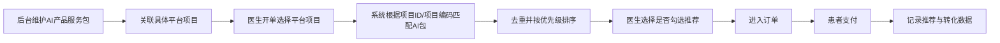

# AI 产品服务包推荐销售方案原型

本文档输出“AI 产品服务包推荐销售方案”的低保真原型。  
本版原型已结合当前后台“平台项目列表”字段结构，以及现有二级 AI 产品服务包清单进行深化。

## 1. 原型范围

本次原型覆盖 4 个核心页面：

1. 后台：AI 产品服务包管理页
2. 后台：AI 产品服务包关联配置页
3. 医生端：开单页推荐模块
4. 患者端：支付确认页

---

## 2. 现有系统约束

根据当前截图，平台项目列表已具备以下典型字段：

- 项目名称
- 项目编码
- 检查类型
- 扫描方式
- 一级编码 / 一级部位
- 二级编码 / 二级部位
- 三级编码 / 三级部位
- 后处理编码 / 后处理
- 状态

因此本次原型设计原则为：

- 不改造现有平台项目主数据结构
- 新增 AI 产品服务包模块
- 通过“关联配置页”把 AI 包与平台项目建立关系
- 医生端推荐基于平台项目精确触发

---

## 3. 后台：AI 产品服务包管理页

### 页面目标

用于新增、编辑、启停 AI 产品服务包，并查看每个包已关联的平台项目数量。

### 页面结构

```text
+------------------------------------------------------------------------------------------------------------------+
| AI 产品服务包管理                                                                                               |
+------------------------------------------------------------------------------------------------------------------+
| 查询条件: [产品包名称/编码] [所属分类] [状态] [价格模式]                                    [查询] [重置] [新建] |
+------------------------------------------------------------------------------------------------------------------+
| 产品包名称     | 分类     | 编码    | 适用检查类型 | 售价 | 价格模式       | 状态 | 已关联项目数 | 更新时间 | 操作 |
|------------------------------------------------------------------------------------------------------------------|
| CT门控钙化积分 | 心脏     | PKG005  | CT           | 90   | 各中心自行定价 | 启用 | 12          | 04-08   | 查看 |
| CT骨密度       | 脊柱     | PKG006  | CT           | 100  | 各中心自行定价 | 启用 | 8           | 04-08   | 编辑 |
| 骨龄DR         | 骨关节   | PKG007  | DR           | 40   | 各中心自行定价 | 启用 | 5           | 04-08   | 编辑 |
| 癌症筛查       | 癌症筛查 | PKG008  | CT           | 35   | 各中心自行定价 | 启用 | 20          | 04-08   | 编辑 |
+------------------------------------------------------------------------------------------------------------------+
```

### 关键交互

- 点击“新建”进入新建页 / 弹窗
- 点击“编辑”修改产品包
- 点击“查看”查看详情与已关联项目
- 点击“已关联项目数”进入关联配置页

### 新建 / 编辑弹窗

```text
+--------------------------------------------------------------------------------------------------+
| 新建 AI 产品服务包                                                                               |
+--------------------------------------------------------------------------------------------------+
| 产品包名称:     [______________________________]                                                 |
| 产品包编码:     [______________________________]                                                 |
| 所属分类:       [心脏 v]                                                                        |
| 适用检查类型:   [CT v]                                                                          |
| 产品简介:       [______________________________________________________________]               |
| 医生推荐话术:   [______________________________________________________________]               |
| 患者展示说明:   [______________________________________________________________]               |
| 销售价格:       [________]                                                                       |
| 价格模式:       ( ) 平台统一定价  (•) 各中心自行定价                                            |
| 状态:           (•) 启用  ( ) 停用                                                               |
| 推荐优先级:     [____]                                                                           |
| [取消]                                                                                 [保存]    |
+--------------------------------------------------------------------------------------------------+
```

### 建议字段映射到当前二级 AI 包清单

- 心脏 → CT 门控钙化积分
- 脊柱 → CT 骨密度
- 骨关节 → 骨龄 DR
- 癌症筛查 → 癌症筛查

---

## 4. 后台：AI 产品服务包关联配置页

### 页面目标

让飞宇总能够基于现有平台项目列表，将 AI 产品服务包与具体检查项目建立推荐关系。

### 核心设计思想

不是只按一级编码做粗匹配，而是以“平台项目行项目”做精确关联。  
一级 / 二级 / 三级部位与扫描方式只作为筛选条件和展示信息。

### 页面布局

```text
+-----------------------------------------------------------------------------------------------------------------------------------+
| AI 产品服务包关联配置                                                                                                              |
+-----------------------------------------------------------------------------------------------------------------------------------+
| 当前产品包: 癌症筛查  | 编码: PKG008 | 适用检查类型: CT | 价格: 35 | 状态: 启用                                                   |
+-----------------------------------------------------------------------------------------------------------------------------------+
| 筛选条件: [检查类型: CT v] [一级部位 v] [二级部位 v] [三级部位 v] [扫描方式 v] [项目名称/编码关键词_______] [查询] [重置]        |
+-----------------------------------------------------------------------------------------------------------------------------------+
| 平台项目列表                                                                                                                       |
|-----------------------------------------------------------------------------------------------------------------------------------|
| 勾选 | 项目名称 | 项目编码 | 检查类型 | 扫描方式 | 一级部位 | 二级部位 | 三级部位 | 后处理 | 状态 | 默认推荐 | 优先级 |
|-----------------------------------------------------------------------------------------------------------------------------------|
| [x]  CT胸部(平扫) | 2001... | CT | 平扫     | 胸部 | 胸部 | 肺部 | -        | 启用 | [ ] | [1] |
| [x]  CT腹部(平扫) | 2002... | CT | 平扫     | 腹部 | 腹部 | 消化 | -        | 启用 | [ ] | [2] |
| [ ]  CT胸部(增强) | 2003... | CT | 增强     | 胸部 | 胸部 | 肺部 | -        | 启用 | [ ] | [ ] |
| [ ]  CT三维重建   | 2004... | CT | 平扫+增强 | 头部 | 头部 | 颅脑 | 颅脑     | 启用 | [ ] | [ ] |
+-----------------------------------------------------------------------------------------------------------------------------------+
| 已选项目数: 2                                                                                                    [保存配置]      |
+-----------------------------------------------------------------------------------------------------------------------------------+
```

### 关键交互

- 先选一个 AI 产品服务包
- 再通过筛选器筛出适合的平台项目
- 勾选具体项目建立关联
- 可为每个关联单独设置默认推荐与优先级
- 保存后即在医生开单端生效

### 专家建议

- 癌症筛查这类产品包，应重点关联“平扫 CT 且部位满足要求”的项目
- 不建议直接关联所有 CT 类项目
- 若业务后续确认“胸部 CT 或腹部 CT 平扫即可”，也应通过具体平台项目项来表达，而不是写成口头规则

---

## 5. 医生端：开单页推荐模块

### 页面目标

当医生开具检查项目时，系统自动展示适配的 AI 产品服务包，医生自主决定是否推荐。

### 页面位置

建议放在“已选检查项目”下方、“订单确认”上方。

### 页面结构

```text
+----------------------------------------------------------------------------------------------------------------------------------+
| 医生开单页                                                                                                                       |
+----------------------------------------------------------------------------------------------------------------------------------+
| 患者信息: 张三 / 男 / 57岁 / 门诊                                                                                                |
|----------------------------------------------------------------------------------------------------------------------------------|
| 已选检查项目                                                                                                                     |
| [x] CT胸部(平扫)                                                                                                                 |
|     项目编码: 2001...  检查类型: CT  扫描方式: 平扫                                                                              |
|                                                                                                                                  |
| [x] CT腹部(平扫)                                                                                                                 |
|     项目编码: 2002...  检查类型: CT  扫描方式: 平扫                                                                              |
|----------------------------------------------------------------------------------------------------------------------------------|
| 推荐 AI 产品服务包                                                                                                               |
| 系统根据当前检查项目，推荐以下 AI 增值服务                                                                                       |
|                                                                                                                                  |
| [ ] 癌症筛查                                                                                                                     |
|     价格: 35元                                                                                                                   |
|     推荐理由: 适用于平扫CT场景，可辅助完成多癌种智能分析                                                                         |
|     说明: 需扫描到相关部位即可                                                                                                   |
|     [查看详情]                                                                                                                   |
|                                                                                                                                  |
| [ ] CT骨密度                                                                                                                     |
|     价格: 100元                                                                                                                  |
|     推荐理由: 适用于胸椎/腰椎相关平扫CT场景                                                                                      |
|     [查看详情]                                                                                                                   |
|----------------------------------------------------------------------------------------------------------------------------------|
| 订单汇总                                                                                                                         |
| 检查项目金额: xxx                                                                                                                |
| AI 产品服务包金额: xxx                                                                                                           |
| 合计: xxx                                                                                                                        |
|                                                                                                               [确认开单]        |
+----------------------------------------------------------------------------------------------------------------------------------+
```

### 关键交互

- 医生选择检查项目后，推荐模块自动刷新
- 默认不勾选
- 勾选后订单汇总实时更新
- 若多个项目命中同一包，只展示一次
- 若命中多个包，默认最多展示 3 个

### 空状态

```text
当前已选检查项目暂无可推荐的 AI 产品服务包
```

### 推荐卡片建议文案结构

- 产品包名称
- 一句话卖点
- 价格
- 适用条件
- 查看详情

---

## 6. 患者端：支付确认页

### 页面目标

让患者清晰看到医生开具的检查项目和 AI 增值服务，并完成支付。

### 页面结构

```text
+------------------------------------------------------------------------------------------------------+
| 支付确认                                                                                             |
+------------------------------------------------------------------------------------------------------+
| 订单内容                                                                                             |
|------------------------------------------------------------------------------------------------------|
| 一、检查项目                                                                                         |
| - CT胸部(平扫)                                                                         300元         |
| - CT腹部(平扫)                                                                         300元         |
|                                                                                                      |
| 二、AI 产品服务包                                                                                    |
| - 癌症筛查                                                                               35元        |
|   说明: 医生推荐的 AI 智能筛查服务，可辅助进行多癌种风险分析                                         |
|                                                                                                      |
| 合计                                                                                     635元       |
|                                                                                         [去支付]     |
+------------------------------------------------------------------------------------------------------+
```

### 关键交互

- 分组展示，避免患者误以为 AI 包是基础检查项目
- 明确展示价格和说明
- 建议支付前支持查看详情，但是否允许移除，需结合现有订单逻辑确认

---

## 7. 推荐逻辑原型



---

## 8. 原型评审重点

- 平台项目关联粒度是否按“项目行项目”执行
- 医生端是否默认不勾选
- 推荐数量上限是否控制为 3 个
- 癌症筛查类产品包的适用项目边界是否明确
- 患者支付页是否需要展示更详细的产品说明

---

## 9. 下一步深化建议

- 输出接口字段清单
- 输出关联配置的数据字典
- 输出医生端交互状态图
- 输出支付链路异常分支
- 如评审通过，再补高保真 UI
