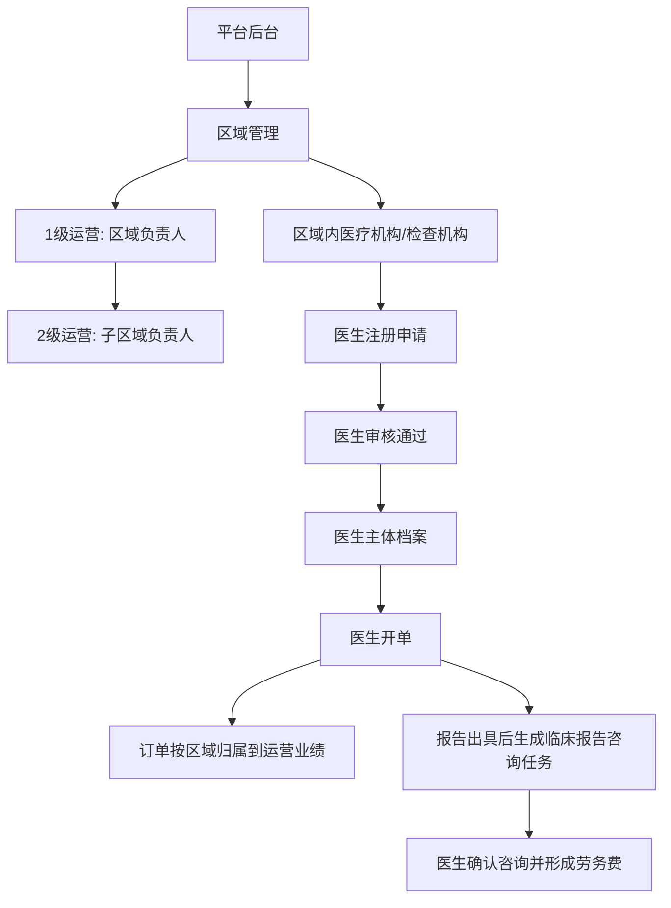
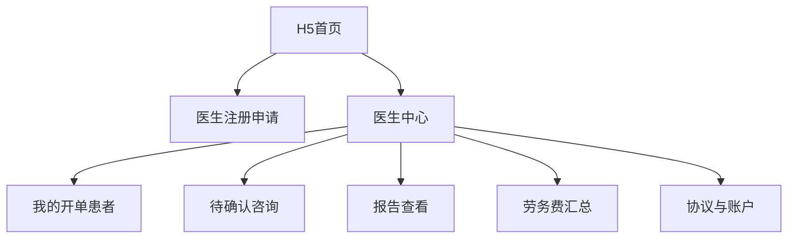
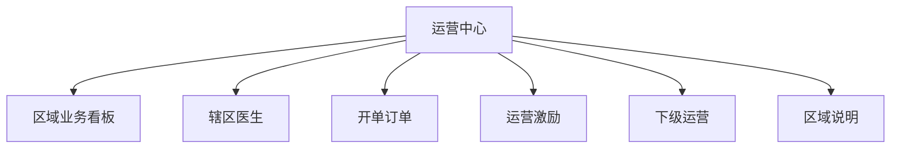
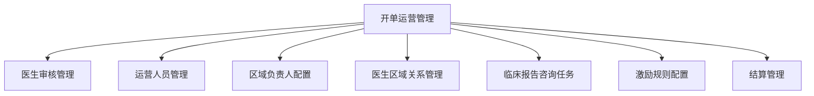
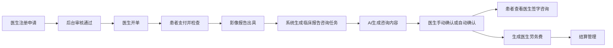
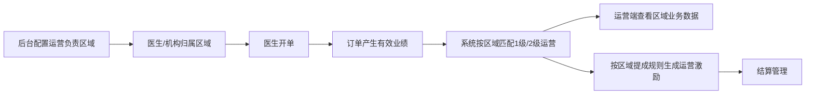

# 开单运营方案 1.0 原型

**文档状态**: V0.1 推进讨论稿  
**适用阶段**: 小范围方案讨论 / 与领导沟通前整理  
**输出日期**: 2026-04-11  
**原型目标**: 将“医生激励 + 运营激励”两条线拆成可评审的页面、关系模型和后台配置方案

## 1. 背景摘要

本方案围绕开单运营 1.0 版本展开，核心背景如下：

1. 本地运营分为两条线：医生激励与运营人员激励。
2. 医生激励通过“临床报告咨询”形成劳务闭环：医生开单后，系统派发咨询任务，由 AI 生成咨询内容，医生手动确认或系统自动确认；患者查看影像报告时可看到医生签字的临床报告咨询，平台据此向医生支付劳务费。
3. 运营人员激励需要满足合规要求，不强调运营人员与医生之间的直接利益绑定关系，而是以区域为主语进行业绩归属。
4. 系统需要支持医生注册申请、医生审核、开单患者订单状态管理、报告查看入口、医生提成汇总、运营区域责任配置、辖区医生业务数据展示。

## 2. 原型范围

本次原型覆盖 3 个端：

1. 医生端 H5
2. 运营端 H5
3. 青藤平台后台

本次原型重点回答 4 个问题：

1. 医生如果不能提前录入平台，如何通过注册申请进入平台身份体系。
2. 1 级运营、2 级运营与医生之间如何建立管理关系。
3. 医生激励如何和“临床报告咨询”任务、报告查看、劳务费结算串起来。
4. 运营激励如何按区域归属，而不是按个人医生绑定关系直接结算。

## 3. 核心关系模型

### 3.1 角色定义

| 角色 | 角色定位 | 核心权限 | 激励口径 |
| --- | --- | --- | --- |
| 开单医生 | 发起检查开单、确认临床报告咨询 | 医生注册申请、查看本人开单患者、查看报告、确认咨询、查看劳务费 | 按本人完成的临床报告咨询任务计劳务费 |
| 1 级运营 | 区域负责人 | 查看负责区域整体业务、维护下级运营、查看区域医生业务数据 | 按负责区域订单业绩计运营激励 |
| 2 级运营 | 子区域/片区运营 | 查看被分配区域业务、维护服务医生、跟进订单转化 | 按被分配子区域订单业绩计运营激励 |
| 后台运营 | 平台管理人员 | 审核医生、配置区域、配置运营负责人、配置规则、处理结算 | 不参与前台激励 |

### 3.2 医生与运营的关联方式

V1 建议采用“区域归属 + 服务关系”双层模型：

1. **区域归属**: 用于运营激励结算。医生开单产生的订单，根据医生所在机构、开单机构、患者检查机构或后台配置的服务区域，归属到某个运营区域。
2. **服务关系**: 用于运营过程管理。运营可以看到自己负责区域内的合作医生，跟进注册、开单、报告咨询等过程，但页面和结算规则不表达“某运营绑定某医生拿提成”。
3. **医生身份**: 如果医生不能由平台提前录入，则通过 H5 申请成为签约医生，后台审核通过后生成医生主体档案。

### 3.3 1 级运营、2 级运营、医生关系



### 3.4 归属优先级建议

当一个医生或订单可能命中多个区域时，建议按以下优先级处理：

1. 后台人工指定的医生服务区域。
2. 开单机构所属区域。
3. 检查机构所属区域。
4. 医生注册时填写的执业机构所在区域。
5. 无法匹配时进入后台“待归属订单”列表，由平台运营人工处理。

## 4. 总体信息架构

### 4.1 医生端 H5



### 4.2 运营端 H5



### 4.3 青藤平台后台



## 5. 医生端原型

## 5.1 页面 1：医生注册申请

### 页面目标

解决“医生不能提前录入平台”的入口问题，让医生通过 H5 完成身份申请、协议确认和结算信息提交。

### 页面结构

```text
+--------------------------------------------------+
| 申请成为签约医生                                 |
+--------------------------------------------------+
| 基础信息                                         |
| 姓名                [____________]               |
| 手机号              [____________]               |
| 所在机构            [____________]               |
| 科室                [____________]               |
| 职称                [____________]               |
+--------------------------------------------------+
| 资质信息                                         |
| 医师资格证编号      [____________]               |
| 医师执业证编号      [____________]               |
| 证件照片            [上传资格证] [上传执业证]    |
+--------------------------------------------------+
| 服务协议                                         |
| [ ] 我已阅读并同意《平台服务协议》               |
| [ ] 我已阅读并同意《临床报告咨询劳务协议》       |
+--------------------------------------------------+
| 结算信息                                         |
| 收款人姓名          [____________]               |
| 结算账号/银行卡     [____________]               |
| 开户行              [____________]               |
+--------------------------------------------------+
|                         [保存草稿] [提交审核]    |
+--------------------------------------------------+
```

### 页面状态

1. 未申请。
2. 草稿。
3. 已提交，待审核。
4. 审核驳回，可重新提交。
5. 审核通过，进入医生中心。

### 关键交互

1. 未勾选协议时不能提交审核。
2. 审核驳回时展示驳回原因和重新编辑入口。
3. 审核通过后，系统生成医生主体档案，并与手机号 / 微信身份关联。
4. 如果后台已存在同手机号医生档案，提交时提示“已匹配历史档案”，进入身份确认流程。

## 5.2 页面 2：医生中心首页

### 页面目标

让医生一眼看到患者进度、待确认咨询和本月劳务费。

### 页面结构

```text
+--------------------------------------------------+
| 医生中心                                         |
+--------------------------------------------------+
| 张医生 / XX医院 / 审核通过                       |
| 本月预计劳务费  ¥360.00                          |
| 待确认咨询      3 单                              |
+--------------------------------------------------+
| 订单状态                                         |
| 待支付 2 | 已支付 8 | 已检查 5 | 已出报告 3      |
+--------------------------------------------------+
| 待我处理                                         |
| 临床报告咨询待确认 3                             |
| 自动确认即将触发 1                               |
|                                      [去处理]     |
+--------------------------------------------------+
| 最近患者                                         |
| 王* / CT胸部平扫 / 报告已出 / 咨询待确认         |
| 李* / MR腰椎 / 已检查 / 等待报告                 |
|                                      [查看全部]   |
+--------------------------------------------------+
| 收益总览                                         |
| 累计劳务费 ¥1,280 | 待结算 ¥360 | 已结算 ¥920    |
+--------------------------------------------------+
```

### 关键交互

1. 点击“去处理”进入待确认咨询列表。
2. 点击患者卡片进入患者订单详情。
3. 收益总览点击后进入劳务费明细。

## 5.3 页面 3：我的开单患者列表

### 页面目标

让医生查看自己开单患者的全流程状态，并形成回访入口。

### 页面结构

```text
+--------------------------------------------------------------------+
| 我的开单患者                                                       |
+--------------------------------------------------------------------+
| 筛选: [患者姓名/手机号] [订单状态 v] [报告状态 v] [查询] [重置]    |
+--------------------------------------------------------------------+
| 患者       | 检查项目       | 订单状态 | 报告状态 | 咨询状态 | 操作 |
|--------------------------------------------------------------------|
| 王*        | CT胸部平扫     | 已检查   | 已出报告 | 待确认   | 查看 |
| 李*        | MR腰椎         | 已支付   | 未出报告 | 未生成   | 查看 |
| 赵*        | CT腹部平扫     | 已出报告 | 已出报告 | 已确认   | 查看 |
+--------------------------------------------------------------------+
```

### 状态字段

1. 订单状态：待支付、已支付、已取消、已退款。
2. 检查状态：待检查、已检查。
3. 报告状态：未出报告、已出报告。
4. 咨询状态：未生成、待确认、已确认、自动确认、已失效。
5. 结算状态：未计费、待结算、已结算、异常。

## 5.4 页面 4：临床报告咨询确认

### 页面目标

医生查看 AI 生成的临床报告咨询内容，确认后形成可支付劳务费的任务记录。

### 页面结构

```text
+------------------------------------------------------------+
| 临床报告咨询确认                                           |
+------------------------------------------------------------+
| 患者信息: 王* / 女 / 56岁                                  |
| 检查项目: CT胸部平扫                                       |
| 报告状态: 已出报告                                         |
| 咨询任务: 待确认                                           |
+------------------------------------------------------------+
| 影像报告摘要                                               |
| 检查所见: ...                                               |
| 检查结论: ...                                               |
+------------------------------------------------------------+
| AI生成临床报告咨询                                         |
| 建议患者结合影像报告结果，按医生建议进行进一步复诊或随访。 |
| [编辑咨询内容]                                             |
+------------------------------------------------------------+
| 医生签字                                                   |
| 张医生 / XX医院                                            |
| [ ] 我确认以上咨询内容                                     |
+------------------------------------------------------------+
|                                      [暂不处理] [确认咨询]  |
+------------------------------------------------------------+
```

### 关键交互

1. 默认展示 AI 生成内容。
2. 医生可编辑咨询内容，但编辑记录需留痕。
3. 勾选确认后，咨询状态变为“已确认”。
4. 超过配置时限未处理时，可按规则进入自动确认，但需后台可配置。

## 5.5 页面 5：医生劳务费明细

### 页面目标

让医生清楚看到每笔劳务费来自哪一个咨询任务。

### 页面结构

```text
+------------------------------------------------------------------+
| 我的劳务费                                                       |
+------------------------------------------------------------------+
| 本月预计 ¥360.00 | 待结算 ¥360.00 | 已结算 ¥920.00               |
+------------------------------------------------------------------+
| 筛选: [月份 v] [结算状态 v] [查询]                               |
+------------------------------------------------------------------+
| 患者 | 检查项目   | 咨询确认时间 | 劳务费 | 结算状态 | 操作      |
|------------------------------------------------------------------|
| 王*  | CT胸部平扫 | 04-10 18:30  | ¥30    | 待结算   | 查看任务  |
| 赵*  | CT腹部平扫 | 04-08 12:20  | ¥30    | 已结算   | 查看任务  |
+------------------------------------------------------------------+
```

## 6. 运营端原型

## 6.1 页面 1：运营中心首页

### 页面目标

运营看到自己负责区域的业务和激励，不强调医生个人绑定收益。

### 页面结构

```text
+--------------------------------------------------+
| 运营中心                                         |
+--------------------------------------------------+
| 当前身份: 1级运营 / 区域负责人                   |
| 负责区域: 杭州市                                 |
| 本月区域订单数 128 | 本月预计激励 ¥2,560          |
+--------------------------------------------------+
| 区域业务概览                                     |
| 今日开单 12 | 已支付 9 | 已检查 6 | 已出报告 3   |
+--------------------------------------------------+
| 辖区医生概览                                     |
| 已审核医生 36 | 待审核/待跟进 5 | 本月活跃 18     |
|                                      [查看医生]   |
+--------------------------------------------------+
| 激励概览                                         |
| 区域业绩 ¥128,000 | 提成比例 2% | 待结算 ¥2,560  |
|                                      [查看明细]   |
+--------------------------------------------------+
| 常用入口                                         |
| [开单订单] [下级运营] [区域说明]                 |
+--------------------------------------------------+
```

### 1 级运营与 2 级运营差异

| 能力 | 1 级运营 | 2 级运营 |
| --- | --- | --- |
| 查看区域总览 | 可看负责区域及下级区域 | 仅看被分配子区域 |
| 查看医生列表 | 可看区域全量医生 | 仅看子区域医生 |
| 查看下级运营 | 可看并维护下级运营 | 不可维护 |
| 激励明细 | 看本人负责区域及下级汇总 | 看本人子区域 |

## 6.2 页面 2：辖区医生列表

### 页面目标

用于运营管理辖区内医生服务关系、注册状态和开单表现。该页面是“服务管理视图”，不是收益绑定视图。

### 页面结构

```text
+--------------------------------------------------------------------------------+
| 辖区医生                                                                       |
+--------------------------------------------------------------------------------+
| 区域: [杭州市 v] [区县 v] [医生姓名/机构] [注册状态 v] [活跃状态 v] [查询]     |
+--------------------------------------------------------------------------------+
| 医生 | 机构 | 服务区域 | 注册状态 | 本月开单 | 咨询完成 | 最近开单 | 操作      |
|--------------------------------------------------------------------------------|
| 张医生 | XX医院 | 西湖区 | 审核通过 | 12       | 8        | 04-10    | 查看      |
| 李医生 | YY医院 | 滨江区 | 待审核   | -        | -        | -        | 跟进      |
| 王医生 | ZZ医院 | 西湖区 | 未注册   | 3        | 0        | 04-08    | 邀请注册  |
+--------------------------------------------------------------------------------+
```

### 关键交互

1. 点击“邀请注册”生成医生注册二维码或邀请链接。
2. 点击“查看”进入医生业务详情，仅展示业务数据和服务进度。
3. 页面文案使用“辖区医生”“服务医生”，避免使用“绑定医生提成”等表达。

## 6.3 页面 3：开单业务数据

### 页面目标

展示运营负责区域内的开单、支付、检查、报告和咨询转化情况。

### 页面结构

```text
+------------------------------------------------------------------------------------------------+
| 区域开单业务数据                                                                               |
+------------------------------------------------------------------------------------------------+
| 筛选: [区域 v] [机构 v] [医生 v] [订单状态 v] [时间范围] [查询] [导出]                         |
+------------------------------------------------------------------------------------------------+
| 订单号 | 患者 | 医生 | 机构 | 检查项目 | 支付状态 | 检查状态 | 报告状态 | 咨询状态 | 区域归属 |
|------------------------------------------------------------------------------------------------|
| O2026041001 | 王* | 张医生 | XX医院 | CT胸部平扫 | 已支付 | 已检查 | 已出报告 | 已确认 | 西湖区 |
| O2026041002 | 李* | 张医生 | XX医院 | MR腰椎     | 已支付 | 待检查 | 未出报告 | 未生成 | 西湖区 |
+------------------------------------------------------------------------------------------------+
```

### 关键交互

1. 运营可按医生、机构、区域筛选业务数据。
2. 导出权限建议仅开放给 1 级运营和后台运营。
3. 如果订单无法识别区域，展示“待归属”，并提示联系后台处理。

## 6.4 页面 4：运营激励明细

### 页面目标

按区域业绩展示运营激励，保证收益口径与医生个人关系解耦。

### 页面结构

```text
+----------------------------------------------------------------------------------+
| 运营激励明细                                                                     |
+----------------------------------------------------------------------------------+
| 本月预计激励 ¥2,560 | 待结算 ¥2,560 | 已结算 ¥8,400                              |
+----------------------------------------------------------------------------------+
| 筛选: [月份 v] [区域 v] [结算状态 v] [查询]                                      |
+----------------------------------------------------------------------------------+
| 区域 | 订单数 | 有效订单金额 | 提成比例 | 预计激励 | 结算状态 | 规则版本 | 操作 |
|----------------------------------------------------------------------------------|
| 西湖区 | 80 | ¥80,000 | 2% | ¥1,600 | 待结算 | R202604 | 查看 |
| 滨江区 | 48 | ¥48,000 | 2% | ¥960   | 待结算 | R202604 | 查看 |
+----------------------------------------------------------------------------------+
```

### 关键规则

1. 激励明细主维度是区域，不是医生。
2. 订单可下钻查看医生和机构，但仅作为业务来源追溯。
3. 结算结果需记录规则版本，避免后续规则调整造成历史数据不可解释。

## 6.5 页面 5：下级运营管理

### 页面目标

让 1 级运营查看或维护 2 级运营的区域分工。

### 页面结构

```text
+----------------------------------------------------------------------------+
| 下级运营管理                                                               |
+----------------------------------------------------------------------------+
| 当前区域: 杭州市                                                           |
| [新增下级运营]                                                             |
+----------------------------------------------------------------------------+
| 姓名 | 手机号 | 负责子区域 | 角色 | 状态 | 本月订单 | 本月预计激励 | 操作   |
|----------------------------------------------------------------------------|
| 陈运营 | 138****0001 | 西湖区 | 2级运营 | 启用 | 80 | ¥1,600 | 编辑 |
| 刘运营 | 138****0002 | 滨江区 | 2级运营 | 启用 | 48 | ¥960   | 编辑 |
+----------------------------------------------------------------------------+
```

### 关键交互

1. 1 级运营可发起新增 2 级运营申请，最终由后台审核生效。
2. 同一子区域同一时间只允许一个主负责人，避免激励重复归属。
3. 历史区域负责人变更必须保留生效时间和失效时间。

## 7. 青藤平台后台原型

## 7.1 页面 1：医生审核管理

### 页面目标

审核医生注册申请，建立医生主体档案。

### 页面结构

```text
+------------------------------------------------------------------------------------------------+
| 医生审核管理                                                                                   |
+------------------------------------------------------------------------------------------------+
| 筛选: [姓名/手机号] [机构] [审核状态 v] [提交时间] [查询] [重置]                               |
+------------------------------------------------------------------------------------------------+
| 医生 | 手机号 | 机构 | 科室 | 提交时间 | 审核状态 | 协议状态 | 结算信息 | 操作                  |
|------------------------------------------------------------------------------------------------|
| 张医生 | 138****0000 | XX医院 | 影像科 | 04-10 | 待审核 | 已签署 | 已填写 | 查看/通过/驳回 |
+------------------------------------------------------------------------------------------------+
```

### 审核详情

```text
+--------------------------------------------------------------+
| 医生审核详情                                                 |
+--------------------------------------------------------------+
| 基础信息: 姓名、手机号、机构、科室、职称                     |
| 资质信息: 资格证编号、执业证编号、证件照片                   |
| 协议信息: 服务协议、劳务协议、签署时间                       |
| 结算信息: 收款人、结算账号、开户行                           |
| 区域归属: [自动识别区域] [手动指定服务区域]                  |
+--------------------------------------------------------------+
| 审核意见: [____________________________________]             |
|                                      [驳回] [审核通过]        |
+--------------------------------------------------------------+
```

## 7.2 页面 2：运营人员管理

### 页面目标

管理运营人员身份、层级、区域权限和状态。

### 页面结构

```text
+--------------------------------------------------------------------------------+
| 运营人员管理                                                                   |
+--------------------------------------------------------------------------------+
| 筛选: [姓名/手机号] [运营层级 v] [负责区域 v] [状态 v] [查询] [新增运营]       |
+--------------------------------------------------------------------------------+
| 姓名 | 手机号 | 层级 | 上级运营 | 负责区域 | 状态 | 生效时间 | 操作            |
|--------------------------------------------------------------------------------|
| 高运营 | 138****1000 | 1级运营 | -      | 杭州市 | 启用 | 04-01 | 编辑/停用 |
| 陈运营 | 138****1001 | 2级运营 | 高运营 | 西湖区 | 启用 | 04-01 | 编辑/停用 |
+--------------------------------------------------------------------------------+
```

### 新增 / 编辑弹窗

```text
+--------------------------------------------------------------+
| 新增运营人员                                                 |
+--------------------------------------------------------------+
| 姓名            [____________]                               |
| 手机号          [____________]                               |
| 运营层级        [1级运营 v]                                  |
| 上级运营        [选择上级运营]                               |
| 负责区域        [选择省/市/区县/街道]                        |
| 生效时间        [____-__-__]                                 |
| 状态            (•) 启用  ( ) 停用                           |
| 备注            [________________________________]           |
|                                      [取消] [保存]            |
+--------------------------------------------------------------+
```

## 7.3 页面 3：区域负责人配置

### 页面目标

按行政区划或业务区划维护区域负责人，作为运营激励归属的基础配置。

### 页面结构

```text
+------------------------------------------------------------------------------------------------+
| 区域负责人配置                                                                                 |
+------------------------------------------------------------------------------------------------+
| 筛选: [省份 v] [城市 v] [区县 v] [负责人] [查询] [新增区域配置]                                |
+------------------------------------------------------------------------------------------------+
| 区域层级 | 区域名称 | 1级运营负责人 | 2级运营负责人 | 生效时间 | 状态 | 操作                   |
|------------------------------------------------------------------------------------------------|
| 城市     | 杭州市   | 高运营         | -              | 04-01 | 启用 | 编辑/查看历史 |
| 区县     | 西湖区   | 高运营         | 陈运营          | 04-01 | 启用 | 编辑/查看历史 |
+------------------------------------------------------------------------------------------------+
```

### 配置规则

1. 区域负责人必须有生效时间。
2. 区域负责人变更不覆盖历史订单归属。
3. 同一层级同一区域同一时间仅允许一个主负责人。

## 7.4 页面 4：医生区域关系管理

### 页面目标

在合规前提下维护医生与区域、机构、服务运营之间的业务关系。

### 页面结构

```text
+------------------------------------------------------------------------------------------------+
| 医生区域关系管理                                                                               |
+------------------------------------------------------------------------------------------------+
| 筛选: [医生/手机号] [机构] [服务区域 v] [关系状态 v] [查询] [新增关系]                         |
+------------------------------------------------------------------------------------------------+
| 医生 | 机构 | 服务区域 | 关系类型 | 服务运营 | 生效时间 | 状态 | 是否用于结算归属 | 操作       |
|------------------------------------------------------------------------------------------------|
| 张医生 | XX医院 | 西湖区 | 区域服务 | 陈运营 | 04-01 | 启用 | 是 | 编辑/停用 |
| 李医生 | YY医院 | 滨江区 | 邀请注册 | 刘运营 | 04-05 | 待确认 | 否 | 查看 |
+------------------------------------------------------------------------------------------------+
```

### 字段说明

| 字段 | 说明 |
| --- | --- |
| 服务区域 | 医生当前业务服务区域，可由系统自动识别或后台手动指定 |
| 关系类型 | 区域服务、邀请注册、人工维护、历史迁移 |
| 服务运营 | 负责跟进该医生服务事项的运营人员 |
| 是否用于结算归属 | 仅在后台规则确认后开启，默认按区域规则计算 |

### 关键约束

1. 页面名称使用“医生区域关系”，不使用“医生绑定提成”。
2. 服务运营可用于过程跟进，但运营激励仍按区域业绩计算。
3. 所有关系变更记录生效时间、失效时间和操作人。

## 7.5 页面 5：临床报告咨询任务管理

### 页面目标

管理医生劳务费对应的咨询任务，支持任务追溯和异常处理。

### 页面结构

```text
+------------------------------------------------------------------------------------------------+
| 临床报告咨询任务管理                                                                           |
+------------------------------------------------------------------------------------------------+
| 筛选: [医生] [患者] [任务状态 v] [报告状态 v] [时间范围] [查询] [导出]                         |
+------------------------------------------------------------------------------------------------+
| 任务号 | 医生 | 患者 | 检查项目 | 报告状态 | 任务状态 | 确认方式 | 劳务费 | 结算状态 | 操作 |
|------------------------------------------------------------------------------------------------|
| T2026041001 | 张医生 | 王* | CT胸部平扫 | 已出报告 | 已确认 | 手动确认 | ¥30 | 待结算 | 查看 |
| T2026041002 | 张医生 | 李* | MR腰椎     | 未出报告 | 未生成 | -        | -   | -      | 查看 |
+------------------------------------------------------------------------------------------------+
```

### 任务状态

1. 未生成。
2. 待确认。
3. 已确认。
4. 自动确认。
5. 已失效。
6. 异常。

## 7.6 页面 6：激励规则配置

### 页面目标

配置医生劳务费规则和运营区域提成规则，并形成规则版本。

### 页面结构

```text
+--------------------------------------------------------------------------------+
| 激励规则配置                                                                   |
+--------------------------------------------------------------------------------+
| [医生劳务费规则] [运营提成规则]                                                |
+--------------------------------------------------------------------------------+
| 规则名称 | 适用范围 | 计算方式 | 金额/比例 | 生效时间 | 状态 | 版本 | 操作       |
|--------------------------------------------------------------------------------|
| 临床咨询劳务费V1 | 全平台 | 按任务固定金额 | ¥30/单 | 04-01 | 启用 | R202604 | 编辑 |
| 区域运营提成V1   | 杭州市 | 按有效订单比例 | 2%     | 04-01 | 启用 | R202604 | 编辑 |
+--------------------------------------------------------------------------------+
```

### 关键规则

1. 医生劳务费按临床报告咨询任务计算。
2. 运营提成按区域有效订单计算。
3. 规则修改必须生成新版本，历史结算沿用历史版本。

## 7.7 页面 7：结算管理

### 页面目标

统一处理医生劳务费与运营激励结算。

### 页面结构

```text
+------------------------------------------------------------------------------------------------+
| 结算管理                                                                                       |
+------------------------------------------------------------------------------------------------+
| [医生劳务费结算] [运营激励结算]                                                               |
+------------------------------------------------------------------------------------------------+
| 结算批次 | 结算对象 | 结算周期 | 订单/任务数 | 应结金额 | 状态 | 生成时间 | 操作                  |
|------------------------------------------------------------------------------------------------|
| S202604-D01 | 张医生 | 2026-04 | 12个咨询任务 | ¥360 | 待审核 | 04-30 | 查看/审核 |
| S202604-O01 | 高运营 | 2026-04 | 128个区域订单 | ¥2,560 | 待审核 | 04-30 | 查看/审核 |
+------------------------------------------------------------------------------------------------+
```

### 关键交互

1. 支持按月生成结算批次。
2. 结算前展示明细来源，包括订单、咨询任务、区域归属和规则版本。
3. 异常数据进入“待处理”状态，不进入正式结算批次。

## 8. 核心业务流程

### 8.1 医生激励流程



### 8.2 运营激励流程



## 9. V1 建议边界

### 9.1 V1 建议做

1. 医生注册申请与后台审核。
2. 医生中心、开单患者列表、报告查看、咨询确认。
3. 医生劳务费汇总与明细。
4. 运营中心、辖区医生、区域开单数据、运营激励明细。
5. 后台运营人员管理、区域负责人配置、医生区域关系管理。
6. 后台医生审核、临床报告咨询任务管理、激励规则配置、结算管理。

### 9.2 V1 暂不建议做

1. 复杂多级分润。
2. 医生排行榜或运营强刺激排行榜。
3. 医生与运营一对一收益绑定展示。
4. 患者端复杂互动咨询，只展示医生签字的临床报告咨询结果。
5. 运营自动调整区域归属，V1 由后台审核或配置生效。

## 10. 待确认问题

1. 医生劳务协议签署是否必须在注册申请时完成，还是审核通过后补签。
2. 医生临床报告咨询是否允许自动确认，自动确认等待时长是多少。
3. 运营激励的“有效订单”定义：按支付成功、检查完成，还是报告出具后计算。
4. 1 级运营与 2 级运营是否都参与结算，还是仅展示不同数据权限。
5. 区域维度最终以城市、区县、街道，还是自定义业务区域为准。
6. 医生如果跨区域开单，按医生归属区域、开单机构区域还是检查机构区域计算。
7. 医生劳务费与运营激励是否同一结算周期、同一审核流程。
8. 运营端是否允许主动邀请医生注册，邀请关系是否只用于服务跟进，不参与结算归属。

## 11. 与领导沟通时建议强调

1. 医生激励是“临床报告咨询劳务费”，有任务、有确认、有患者可见结果，逻辑闭环较清晰。
2. 运营激励用“区域负责人”表达，减少运营与医生之间的直接利益绑定风险。
3. 医生无法提前录入平台时，通过 H5 注册申请 + 后台审核生成医生主体档案。
4. 1 级运营、2 级运营、医生之间的关系建议拆成“区域归属”和“服务关系”，前者用于结算，后者用于过程管理。
5. V1 先跑通身份、区域、订单、咨询、激励、结算闭环，复杂分润和强运营刺激后置。
