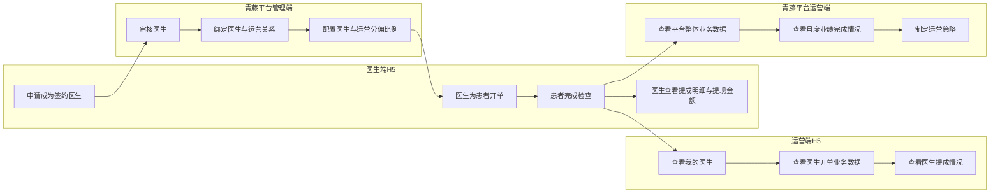

# 运营/医生激励方案 - 需求分析

## 一、需求背景分析

### 1.1 业务背景

- 一脉青藤当前存在检查业务，希望通过医生给患者开单提升机构检查业务订单。
- 医生并非平台天然自有资源，而是由平台运营人员持续发展、维护和激活。
- 因此，平台不仅要关注整体检查订单增长，还要关注运营发展医生后的业务贡献情况。

### 1.2 当前问题

- 医生侧缺少完整的签约、提成查看、提现金额查看入口。
- 平台管理端缺少医生审核、医生与运营绑定、分佣比例配置的线上闭环。
- 运营侧无法及时看到自己发展的医生开单数据、提成情况和月度业务表现。
- 平台运营侧缺少全平台业务数据视角，难以进行月度复盘和策略调整。

### 1.3 不做的影响

- 医生开单动力不足，业务增长依赖线下推动。
- 运营无法判断自己发展的医生产出效果，难以持续跟进。
- 平台只能看到零散结果，无法系统管理整体业务和激励效果。

## 二、需求目标确认

### 2.1 业务目标

- 提升医生带动的检查业务订单规模。
- 建立运营发展医生后的业务归因关系。
- 让平台能够基于整体业务数据做月度经营管理。

### 2.2 用户目标

#### 医生

- 可以申请成为签约医生。
- 可以查看每一单提成情况。
- 可以查看累计提成、可提现金额等数据。

#### 运营

- 可以查看自己发展的医生名单。
- 可以查看这些医生的开单业务数据和提成情况。
- 可以按月跟踪业务完成情况。

#### 平台管理 / 平台运营

- 可以审核医生、建立绑定关系、配置分佣比例。
- 可以查看平台整体业务数据、医生表现、运营表现。
- 可以按月复盘业绩并制定提升策略。

## 三、业务流程分析

### 3.1 当前流程（现状）

#### 3.1.1 医生成为签约医生的当前流程

当前医生成为签约医生，并不是完全通过系统自助完成，而是先由运营人员在线下完成业务沟通。

具体流程为：

1. 运营人员先到诊所与医生线下沟通合作模式。
2. 重点沟通内容包括：
   - 医生如何通过 H5 为患者开单
   - 患者完成检查后，平台如何以报告解读费形式给医生分佣
   - 每单分佣比例如何约定
3. 当运营与医生在线下确认合作意向后，医生再进入 H5 的签约医生申请入口。
4. 医生在 H5 中补充诊所信息、个人资质等资料并提交申请。
5. 青藤后台管理人员对医生申请资料进行审核。
6. 审核通过后，医生成为签约医生，进入后续开单和提成链路。

#### 3.1.2 医生与运营关系的当前设计思路

当前医生与运营的绑定关系，系统仍在设计中，目标是通过系统化方式维护，而不是长期依赖人工表格。

当前初步方案为：

1. 运营在系统中配置两个核心属性：
   - 负责区域
   - 负责科室
2. 医生侧保留两个对应属性：
   - 诊所所在区域
   - 人工设置的医生所属科室
3. 系统基于“运营负责区域/负责科室”与“医生诊所区域/医生科室标签”进行自动匹配。
4. 匹配优先级上，科室优先级高于区域优先级。

这样设计的原因是：

- 在业务启动阶段，医生实际合作来源可能与自然区域归属不一致。
- 例如某医生所在诊所位于运营 B 的区域，但实际是由运营 A 签下来的。
- 为避免仅按区域归属导致绑定错误，需要通过“科室标签”进行人为纠偏。
- 因此，系统层面需要支持“科室优先、区域次之”的绑定逻辑。

#### 3.1.3 当前分佣规则的现状

当前分佣规则主要由平台管理层先确定运营侧提成比例，再由运营与医生线下谈判医生提成比例。

现状规则可理解为：

1. 平台先给运营设置固定提成比例，例如每单利润的 15%。
2. 运营再与不同医生谈判医生端提成比例。
3. 运营提成 = 平台给运营的总比例 - 医生提成比例。

例如：

- 平台给运营 A 的提成比例是 15%
- 运营 A 与医生 A 约定医生提成 10%
- 则医生 A 每开一单，医生得 10%，运营 A 得 5%

如果：

- 平台给运营 A 的提成比例仍为 15%
- 运营 A 与医生 B 约定医生提成 8%
- 则医生 B 每开一单，医生得 8%，运营 A 得 12%

因此，分佣比例需要在“医生与运营建立关联关系”时同步设置，并在系统中维护。

#### 3.1.4 当前数据可见性的现状

当前系统尚未形成完整的数据可视化闭环：

- 医生开单后，医生本人无法看到自己的提成情况
- 运营无法看到自己发展医生的开单数据
- 平台管理层无法看到全平台业务数据

### 3.2 目标流程

## 四、功能拆解清单

| 终端 | 模块 | 功能 | 功能描述 | 优先级 |
|------|------|------|----------|--------|
| 医生端H5 | 我的管理 | 签约医生申请 | 医生提交签约申请 | Must |
| 医生端H5 | 提成中心 | 提成总览 | 查看累计提成、可提现金额 | Must |
| 医生端H5 | 提成中心 | 提成明细 | 查看每一单提成情况 | Must |
| 平台管理端 | 医生管理 | 医生审核 | 审核医生签约申请 | Must |
| 平台管理端 | 关系管理 | 医生运营绑定 | 配置医生与运营归属关系 | Must |
| 平台管理端 | 激励配置 | 分佣比例配置 | 配置医生和运营分佣比例 | Must |
| 运营端H5 | 我的医生 | 医生列表 | 查看自己发展的医生 | Must |
| 运营端H5 | 数据看板 | 医生业务数据 | 查看医生开单业务数据 | Must |
| 运营端H5 | 数据看板 | 医生提成数据 | 查看医生提成和业务表现 | Must |
| 平台运营端 | 总览看板 | 平台整体业务数据 | 查看全平台业务数据总览 | Must |
| 平台运营端 | 经营分析 | 月度业绩复盘 | 查看月度业绩和趋势变化 | Should |
| 平台运营端 | 经营分析 | 策略管理 | 根据数据制定运营策略 | Should |

## 五、待确认事项

| 序号 | 待确认事项 | 状态 | 负责人 | 截止日期 |
|------|------------|------|--------|----------|
| 1 | 运营与医生绑定时，区域与科室的自动匹配规则如何精确定义 | 待确认 | - | - |
| 2 | 改绑后的历史订单与新订单切分规则是否按生效时间点统一处理 | 待确认 | - | - |
| 3 | 提现申请后的实际打款流程由系统承接还是线下财务承接 | 待确认 | - | - |
| 4 | 平台管理端是否需要区分平台管理员与平台运营角色的数据权限 | 待确认 | - | - |
| 5 | 已出报告患者的后续维护入口具体承载哪些动作与记录字段 | 待确认 | - | - |
| 6 | 平台运营端月度复盘页是否需要记录策略执行结果与责任人 | 待确认 | - | - |

## 六、核心规则（第一版）

### 6.1 提成触发节点

医生提成不在“仅支付完成”时立即生效，而是在以下条件同时满足后生效：

- 患者已支付
- 患者已完成线下检查
- 医生已撰写报告
- 报告审核完成
- 系统已向患者推送查看报告通知

也就是说，提成确认节点建议定义为：已支付且已出报告。

平台以“报告解读费”形式给医生计提分佣。

### 6.2 订单统计口径

“开单数”首期建议按患者支付后算 1 单统计。也就是说，医生发起了订单但患者未支付，不计入正式开单数。

### 6.3 医生提成统计口径

医生提成金额仅统计满足以下条件的订单：

- 患者已支付
- 患者已完成检查
- 报告已审核通过并成功出报告

即：提成确认口径为“已支付且已出报告”。

### 6.4 异常订单规则

- 患者已支付但未完成检查：不产生提成
- 患者完成检查但报告被驳回重写：待最终报告审核通过后再确认提成
- 订单退款：医生提成和运营提成均需冲回

### 6.5 运营数据查看范围

运营端只允许查看自己发展的医生相关业务数据，不可查看其他运营名下医生数据。

### 6.6 医生归属规则

一个医生只能归属一个运营。平台管理端有权限调整医生归属关系。

### 6.7 医生改绑规则

系统支持人工改绑。当前业务上，改绑通常通过调整医生绑定科室，使其匹配新的运营负责科室，从而完成归属切换。

改绑后的数据归属规则为：

- 历史订单归原运营
- 新订单归新运营

### 6.8 分佣配置权限

平台管理端有权限调整：

- 医生归属
- 医生提成比例
- 运营提成比例

分佣比例配置建议记录以下字段：

- 生效时间
- 失效时间
- 当前状态

### 6.9 提现规则建议

本期建议支持：

- 医生查看可提现金额
- 医生提交提现申请
- 平台管理端审核提现申请
- 系统记录提现状态

本期不建议直接接入自动微信零钱打款。

### 6.10 平台运营端筛选维度

平台运营端首期建议支持以下筛选维度：

- 时间
- 运营
- 区域
- 科室
- 医生

### 6.11 运营端 H5 核心查看内容

运营端首期重点展示：

- 我绑定了哪些医生
- 我发展的医生开单情况
- 我的提成情况

同时支持查看：

- 汇总数据
- 医生明细
- 订单明细

### 6.12 医生端首期重点查看内容

医生端首期重点展示：

- 订单状态分布，包括：已支付、已取消、已检查、已出报告
- 解读报告费提成金额
- 对应订单提成明细
- 已出报告患者的后续维护入口

其中，患者后续维护首期建议支持：

- 复查提醒
- 随访记录

### 6.13 平台运营端核心指标

平台运营端首期建议重点关注以下指标：

- 开单数
- 运营覆盖医生数
- 医生提成金额

### 6.14 平台运营端重点关注问题

平台运营端月度复盘首期重点关注：

- 哪些医生开单少
- 哪些运营发展医生少

## 七、平台端关键页面要求（第一版）

### 7.1 平台管理端 - 医生审核

平台管理端审核医生时，首期至少审核以下资料：

- 姓名
- 手机号
- 诊所名称
- 执业资质
- 所在区域具体位置

### 7.2 平台运营端 - 看板能力

平台运营端首期建议支持：

- 汇总指标查看
- 医生维度明细查看
- 订单维度明细查看
