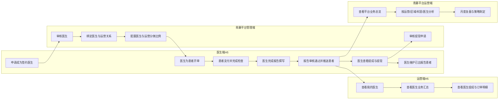

# 运营/医生激励方案 - PRD

## 一、需求背景

### 1.1 业务背景

一脉青藤当前存在检查业务，平台希望通过医生给患者开单的方式提升机构检查业务订单规模。

但当前医生并不是平台天然拥有的稳定资源，而是主要由运营人员在线下进行拓展、沟通和维护。运营人员需要先与诊所和医生沟通业务模式，包括如何通过 H5 为患者开单、患者完成检查后如何以报告解读费的方式给医生分佣，以及每单分佣比例如何约定。在双方线下确认合作后，医生再通过 H5 提交签约申请，由青藤后台管理人员审核通过后进入业务链路。

这意味着，该业务并不是简单的“医生开单”问题，而是一套围绕“运营拓展医生 -> 医生签约 -> 医生开单 -> 患者完成检查并出报告 -> 医生和运营获得提成 -> 平台进行整体经营管理”的完整激励与经营链路。

### 1.2 当前问题

#### 1.2.1 医生侧问题

- 医生虽然可以参与业务合作，但缺少线上化、标准化的签约与状态承接入口。
- 医生开单后，无法实时查看患者订单状态，例如已支付、已取消、已检查、已出报告。
- 医生无法查看每一单的报告解读费提成情况，也无法查看累计提成、可提现金额与提现进度。
- 医生对已出报告患者缺少统一的后续维护入口，不利于复查提醒和随访记录。

#### 1.2.2 运营侧问题

- 运营人员当前无法在线查看自己发展医生的开单业务数据。
- 运营无法查看自己绑定医生的支付、出报告、提成等关键业务结果。
- 运营无法从系统中快速判断自己负责医生的经营表现，也无法形成持续跟进。

#### 1.2.3 平台管理侧问题

- 平台尚未形成完整的医生审核、医生与运营绑定、分佣比例配置的线上闭环。
- 医生与运营的关系正在设计中，当前仍缺少可持续维护、可追溯的系统化方案。
- 分佣比例虽然已有业务规则，但缺少统一配置和生效管理能力。

#### 1.2.4 平台运营侧问题

- 平台管理层当前无法查看全平台业务数据。
- 平台无法从运营、区域、科室、医生等多个维度系统分析业务表现。
- 平台缺少月度复盘和策略管理页面，无法持续识别“哪些医生开单少、哪些运营发展医生少”等经营问题。

### 1.3 建设价值

本次需求建设完成后，将形成以下价值：

- 对医生：让医生看到开单结果与提成回报，增强参与积极性。
- 对运营：让运营看到自己发展的医生业务表现与自身提成，形成可量化结果。
- 对平台：让平台掌握全局业务数据，建立从签约、绑定、分佣、提成到经营分析的管理闭环。
- 对业务增长：通过“医生激励 + 运营激励 + 平台复盘”共同推动检查业务增长。

## 二、需求目标

### 2.1 业务目标

- 提升医生带动的检查业务订单规模。
- 建立运营发展医生后的业务归因关系。
- 建立医生激励、运营激励与平台经营分析的一体化闭环。
- 让平台能够基于整体业务数据进行月度经营管理与策略制定。

### 2.2 用户目标

#### 医生

- 可以在线提交签约医生申请。
- 可以查看患者订单状态和每单提成情况。
- 可以查看本月提成、累计提成、可提现金额和申请中金额。
- 可以对已出报告患者进行复查提醒和随访记录。

#### 运营

- 可以查看自己绑定的医生名单。
- 可以查看自己发展医生的开单、支付、出报告与提成情况。
- 可以查看自身提成金额和阶段性业务成果。

#### 平台管理端

- 可以审核签约医生申请。
- 可以管理医生与运营的绑定关系。
- 可以维护医生提成比例、运营提成比例及其生效状态。

#### 平台运营端

- 可以查看平台整体业务数据。
- 可以从运营、区域、科室、医生等维度分析业务表现。
- 可以按月识别问题、记录策略并追踪执行结果。

### 2.3 产品目标

- 在医生端 H5 建立签约、订单状态查看、提成查看、提现申请、患者维护能力。
- 在运营端 H5 建立“我的医生”、业务汇总、医生明细和订单明细查看能力。
- 在平台管理端建立医生审核、自动匹配绑定、手动改绑、分佣配置能力。
- 在平台运营端建立总览看板、业绩分析、月度复盘与策略页。

## 三、需求核心业务流程图

### 3.1 目标流程图

### 3.2 关键规则说明

- 正式开单数按“患者支付后”统计。
- 医生提成确认口径为“已支付且已出报告”。
- 患者已支付但未完成检查，不产生提成。
- 订单退款后，医生提成和运营提成需冲回。
- 一个医生只能归属一个运营，但平台管理端支持人工改绑。
- 医生改绑后，历史订单归原运营，新订单归新运营。

## 四、需求功能清单

| 终端 | 模块 | 功能 | 描述 |
|------|------|------|------|
| 医生端H5 | 我的管理 | 签约医生申请入口 | 医生进入个人管理页后可发起签约医生申请 |
| 医生端H5 | 我的管理 | 订单状态总览 | 实时查看本人相关订单状态，包括已支付、已取消、已检查、已出报告 |
| 医生端H5 | 提成中心 | 提成总览 | 查看本月提成、累计提成、可提现金额、申请中金额、已出报告订单数 |
| 医生端H5 | 提成中心 | 提成明细 | 按订单查看报告解读费提成明细 |
| 医生端H5 | 提现 | 提现申请 | 医生提交提现申请 |
| 医生端H5 | 提现 | 提现记录 | 查看提现申请历史、处理进度与结果 |
| 医生端H5 | 患者维护 | 已出报告患者列表 | 查看已出报告患者并进行后续维护 |
| 医生端H5 | 患者维护 | 复查提醒/随访记录 | 对已出报告患者记录复查提醒和随访内容 |
| 医生端H5 | 我的资料 | 医生资料查看 | 查看医生基础信息、诊所信息、资质信息、收款方式 |
| 运营端H5 | 我的医生 | 医生汇总列表 | 查看自己绑定医生列表及核心业务数据 |
| 运营端H5 | 我的医生 | 筛选查询 | 按时间、医生、区域、科室、订单状态筛选医生数据 |
| 运营端H5 | 业绩详情 | 医生业务汇总 | 查看单个医生的开单、支付、出报告等业务表现 |
| 运营端H5 | 业绩详情 | 医生提成明细 | 查看单个医生对应的医生提成明细 |
| 运营端H5 | 业绩详情 | 订单明细 | 查看单个医生对应的订单维度明细 |
| 运营端H5 | 首页汇总 | 运营指标汇总 | 查看我绑定医生数、本月开单数、已出报告订单数、我的提成金额、本月新增签约医生数 |
| 平台管理端 | 医生审核 | 医生申请列表 | 查看签约医生申请记录 |
| 平台管理端 | 医生审核 | 审核通过/驳回 | 对医生申请进行通过或驳回处理 |
| 平台管理端 | 医生审核 | 科室设置 | 在审核或审核后设置医生所属科室 |
| 平台管理端 | 医生审核 | 审核结果通知 | 审核通过/驳回后自动短信通知医生 |
| 平台管理端 | 绑定管理 | 自动匹配绑定 | 按运营负责区域和负责科室自动匹配医生 |
| 平台管理端 | 绑定管理 | 手动改绑 | 管理员手动调整医生归属运营 |
| 平台管理端 | 绑定管理 | 绑定关系列表 | 查看医生、运营、绑定状态、生效时间、区域、科室等信息 |
| 平台管理端 | 分佣管理 | 分佣比例配置 | 配置医生分佣比例、运营提成比例、平台给运营总比例 |
| 平台管理端 | 分佣管理 | 分佣版本生效 | 支持设置生效时间、失效时间、状态 |
| 平台管理端 | 分佣管理 | 历史版本查看 | 查看比例调整历史与最近修改人 |
| 平台管理端 | 提现审核 | 提现申请审核 | 审核医生提现申请并更新状态 |
| 平台运营端 | 总览看板 | 核心指标总览 | 查看全平台开单数、已支付订单数、已出报告订单数、医生提成总金额、运营提成总金额等 |
| 平台运营端 | 总览看板 | 趋势与排行 | 查看时间趋势图、区域排行、运营排行、医生排行、科室分布 |
| 平台运营端 | 业绩分析 | 运营汇总 | 按运营维度查看整体业务表现 |
| 平台运营端 | 业绩分析 | 医生明细 | 按医生维度下钻查看业务与提成表现 |
| 平台运营端 | 业绩分析 | 订单明细 | 按订单维度查看支付、出报告、提成等明细 |
| 平台运营端 | 月度复盘 | 问题医生识别 | 识别开单少、长时间无新增订单、支付后未转出报告的医生 |
| 平台运营端 | 月度复盘 | 问题运营识别 | 识别发展医生少、绑定医生多但开单少、区域增长慢的运营 |
| 平台运营端 | 月度复盘 | 策略记录与跟踪 | 记录问题、下月策略、负责人、截止时间、执行结果 |

## 五、需求功能详述

### 5.1 医生端 H5

#### 5.1.1 我的管理

**功能描述**

医生进入 H5 后，可在“我的管理”页统一查看签约状态、订单状态总览、提成入口、提现记录、患者维护入口和个人资料入口。

**页面目标**

- 成为医生侧的统一业务入口
- 让医生快速查看与自己相关的核心业务结果
- 让医生能从一个页面进入签约、提成、提现、患者维护等功能

**页面模块**

- 签约医生申请入口
- 订单状态总览
- 提成中心入口
- 提现记录入口
- 我的患者维护入口
- 我的资料入口

**核心展示内容**

- 当前签约状态
- 已支付订单数
- 已取消订单数
- 已检查订单数
- 已出报告订单数

**关键交互**

- 未签约医生：展示“申请成为签约医生”入口
- 已提交待审核：展示“审核中”状态，不可重复申请
- 已审核通过：展示签约状态和后续业务入口
- 点击提成中心：进入提成中心页
- 点击提现记录：进入提现记录页
- 点击我的患者：进入患者维护页
- 点击我的资料：进入资料页

**规则说明**

- 订单状态统计范围仅统计当前医生相关订单
- 正式开单数按患者支付后统计
- 订单状态口径需与平台侧保持一致

---

#### 5.1.2 签约医生申请

**功能描述**

医生在线下与运营确认合作意向后，可通过 H5 提交签约医生申请，由平台管理端进行审核。

**输入字段**

- 姓名
- 手机号
- 诊所名称
- 诊所地址
- 执业资质上传
- 银行卡/收款方式
- 备注说明

**字段规则**

- 所属科室不由医生填写，由平台后台业务人员设置
- 执业资质需支持上传并供平台审核
- 收款方式信息用于后续提现处理

**关键交互**

- 医生填写资料后提交申请
- 提交后页面显示“审核中”状态
- 审核通过或驳回后，系统通过短信通知医生

**状态流转**

- 未申请
- 审核中
- 审核通过
- 审核驳回

**异常处理**

- 必填字段缺失时不可提交
- 资质上传失败时需提示重新上传
- 审核驳回时需向医生展示驳回结果，并允许后续重新发起申请

---

#### 5.1.3 提成中心

**功能描述**

医生在提成中心统一查看与自身相关的提成概况、可提现金额、申请中金额和已出报告订单数，并进入提成明细或提现流程。

**核心指标**

- 本月提成
- 可提现金额
- 申请中金额
- 累计提成金额
- 已出报告订单数

**关键交互**

- 点击“提成明细”进入订单维度提成明细页
- 点击“提现申请”进入提现申请流程
- 点击“提现记录”进入提现记录页

**规则说明**

- 医生提成确认口径为“已支付且已出报告”
- 已支付但未完成检查订单，不产生提成
- 报告驳回重写订单，待最终审核通过后确认提成
- 订单退款后，对应医生提成需冲回

**金额口径建议**

- 本月提成：本月确认入账的提成总额
- 可提现金额：已确认且未申请提现的提成金额
- 申请中金额：已提交提现申请、待平台处理的金额
- 累计提成金额：历史累计已确认提成总额

---

#### 5.1.4 提成明细

**功能描述**

医生按订单维度查看每一单的提成记录，清楚了解患者、订单、检查项目、时间节点和提成金额。

**列表字段**

- 订单号
- 患者姓名
- 手机号
- 检查项目
- 检查项目金额
- 支付时间
- 出报告时间
- 订单状态
- 提成金额
- 提成状态

**提成状态建议**

- 待确认
- 已确认
- 已申请提现
- 已打款
- 已冲回

**筛选条件建议**

- 时间范围
- 订单状态
- 提成状态
- 患者姓名/手机号

**规则说明**

- 仅展示当前医生本人相关订单的提成记录
- 提成状态必须与提现状态、订单状态联动
- 若订单退款，对应提成记录需更新为已冲回

---

#### 5.1.5 提现申请与提现记录

**功能描述**

医生可对可提现金额发起提现申请，并查看历史提现申请记录和当前处理进度。

**提现申请规则建议**

- 仅可对“可提现金额”范围内的金额发起申请
- 提现申请提交后，对应金额从“可提现金额”转入“申请中金额”
- 提现申请需由平台管理端审核

**提现记录字段**

- 申请时间
- 申请金额
- 提现状态
- 处理时间
- 驳回原因

**提现状态建议**

- 待审核
- 审核通过
- 已打款
- 已驳回

**本期建议**

- 本期先支持提现申请、审核、状态记录
- 本期不直接接入自动微信零钱打款
- 实际打款流程可由平台线下财务或现有支付流程承接

---

#### 5.1.6 患者维护

**功能描述**

医生对已出报告患者进行后续维护，支持复查提醒和随访记录，增强患者持续管理能力。

**页面结构**

- 已出报告患者列表
- 患者基础信息区
- 随访记录区
- 复查提醒区

**核心交互**

- 在已出报告患者列表中直接点击“添加随访”
- 对单个患者设置复查提醒
- 查看患者历史随访记录

**规则说明**

- 仅允许对已出报告患者进行维护
- 随访记录需保留操作时间与记录内容
- 复查提醒需支持后续查看和跟踪

#### 5.1.7 我的资料

**功能描述**

医生查看自身基础信息、诊所信息、资质信息和收款方式信息。

**页面模块**

- 医生基础信息
- 诊所信息
- 资质信息
- 收款方式信息

**说明**

- 本期以查看为主
- 若后续涉及资料修改，可在下一版本补充资料变更流程

### 5.2 运营端 H5

#### 5.2.1 运营端首页/汇总页

**功能描述**

运营进入 H5 后，首页先展示自身负责范围内的核心业绩汇总，帮助运营快速判断当前业务表现和重点跟进方向。

**核心指标**

- 我绑定医生数
- 本月开单数
- 已出报告订单数
- 我的提成金额
- 本月新增签约医生数

**页面模块**

- 指标汇总卡
- 业务趋势区
- 医生贡献排行
- 异常提醒区

**页面目标**

- 先让运营看到整体结果
- 再引导运营进入“我的医生”查看医生明细
- 帮助运营快速识别近期业务变化

**规则说明**

- 运营仅查看自己权限范围内的数据
- 各指标统计口径需与平台端保持一致
- 我的提成金额需与医生开单和提成规则联动

---

#### 5.2.2 我的医生

**功能描述**

运营查看自己绑定医生的整体列表和业务结果，并支持按条件筛选定位重点医生。

**页面结构**

- 先看汇总卡
- 再看医生列表

**筛选条件**

- 时间
- 医生
- 区域
- 科室
- 订单状态

**医生列表字段**

- 医生姓名
- 诊所名称
- 所属区域
- 所属科室
- 累计开单数
- 已支付订单数
- 已出报告订单数
- 医生提成金额
- 我的提成金额

**关键交互**

- 支持按筛选条件定位目标医生
- 点击医生进入“医生业绩详情页”
- 支持从列表直接查看医生当前经营情况

**页面目标**

- 帮助运营快速掌握自己绑定医生的数量和表现
- 识别重点医生、低活跃医生和高贡献医生
- 为后续跟进提供基础数据入口

**规则说明**

- 仅展示当前运营名下医生数据
- 医生改绑后，历史订单归原运营，新订单归新运营
- 医生列表中的提成和订单数据需根据时间筛选条件同步变化

---

#### 5.2.3 医生业绩详情

**功能描述**

运营点击单个医生后，查看该医生的业务汇总、提成明细、时间趋势和订单明细，以便判断该医生的业务活跃度和经营贡献。

**页面模块**

- 业务汇总
- 医生提成明细
- 时间趋势
- 订单明细

**业务汇总建议展示**

- 累计开单数
- 已支付订单数
- 已出报告订单数
- 医生提成金额
- 我的提成金额

**时间趋势建议展示**

- 按天/周/月查看开单变化趋势
- 按天/周/月查看已出报告变化趋势
- 按天/周/月查看提成变化趋势

**订单明细建议字段**

- 订单号
- 患者姓名
- 检查项目
- 支付时间
- 出报告时间
- 订单状态
- 医生提成金额
- 运营提成金额

**关键交互**

- 支持按时间范围查看该医生的阶段性表现
- 支持查看医生订单明细和提成明细
- 支持从趋势下钻到具体订单数据

**规则说明**

- 订单口径按“患者支付后算正式开单”
- 提成口径按“已支付且已出报告”统计
- 已退款订单对应医生提成和运营提成需冲回

---

#### 5.2.4 运营端核心使用路径

**路径说明**

1. 运营先在首页查看本期核心指标。
2. 运营进入“我的医生”，筛选并定位目标医生。
3. 运营进入医生业绩详情，查看业务汇总、提成明细、趋势和订单情况。
4. 运营基于数据判断需要重点跟进的医生与业务问题。

### 5.3 平台管理端

#### 5.3.1 医生审核列表

**功能描述**

平台管理端对医生提交的签约申请进行审核，并在审核过程中补充设置医生所属科室，形成后续绑定和分佣配置的基础数据。

**页面模块**

- 审核状态筛选区
- 医生搜索区
- 医生审核列表
- 审核操作区

**列表字段**

- 申请时间
- 医生姓名
- 手机号
- 诊所名称
- 所在区域
- 所属科室
- 当前审核状态
- 启用状态
- 备注

**核心操作**

- 按审核状态筛选
- 按医生姓名和手机号搜索
- 审核通过
- 审核驳回
- 设置医生所属科室

**规则说明**

- 医生审核时至少需校验姓名、手机号、诊所名称、执业资质、所在区域具体位置
- 所属科室由平台后台业务人员设置，不由医生自行提交
- 审核通过或驳回后，系统自动短信通知医生
- 审核驳回时需保留驳回原因

**状态流转建议**

- 待审核
- 审核通过
- 审核驳回
- 已启用
- 已停用

---

#### 5.3.2 医生与运营绑定管理

**功能描述**

平台管理端维护医生与运营之间的归属关系，支持系统自动匹配，也支持管理员手动改绑。

**页面模块**

- 运营人员筛选区
- 医生/运营搜索区
- 绑定关系列表
- 绑定编辑区

**列表字段**

- 医生姓名
- 医生提成比例
- 手机号
- 诊所名称
- 诊所区域
- 医生所属科室
- 当前绑定运营名
- 运营提成比例
- 运营负责区域
- 运营负责科室
- 绑定生效时间
- 启用状态
- 绑定状态

**绑定逻辑**

- 系统基于“运营负责区域 / 运营负责科室”与“医生诊所区域 / 医生所属科室”进行自动匹配
- 科室优先级高于区域优先级
- 系统自动匹配后，管理员可人工确认或改绑

**核心操作**

- 按运营筛选其已绑定医生列表
- 医生与运营双向搜索
- 编辑运营与医生关系
- 编辑医生提成比例
- 编辑运营提成比例
- 查看绑定状态和生效时间

**规则说明**

- 一个医生只能归属一个运营
- 平台管理端有权调整医生归属关系
- 医生改绑后，历史订单归原运营，新订单归新运营
- 绑定状态需支持启用/停用

---

#### 5.3.3 分佣比例配置页

**功能描述**

平台管理端配置医生和运营的提成比例，并记录比例的生效时间、失效时间、状态和历史版本。

**关键字段**

- 医生姓名
- 运营姓名
- 平台给运营总比例
- 医生分佣比例
- 运营实际提成比例
- 生效时间
- 失效时间
- 状态
- 最近修改人

**核心操作**

- 保存配置
- 停用配置
- 查看历史版本

**比例规则说明**

- 平台先给运营设定总提成比例
- 医生分佣比例由运营与医生协商后确认
- 运营实际提成比例 = 平台给运营总比例 - 医生分佣比例
- 比例配置需与具体医生-运营关系关联维护

**生效规则说明**

- 每条比例配置需记录生效时间
- 需支持失效时间和当前状态管理
- 新订单按当前有效比例配置计算提成
- 历史订单保持历史规则，不因后续比例调整而回溯变更

---

#### 5.3.4 提现申请审核

**功能描述**

平台管理端对医生提交的提现申请进行审核，并维护提现申请处理状态。

**页面目标**

- 建立医生提现申请的线上审核闭环
- 让医生端可查看提现申请进度
- 让平台可记录提现处理结果

**关键字段建议**

- 申请时间
- 医生姓名
- 申请金额
- 当前可提现金额
- 提现状态
- 审核人
- 处理时间
- 驳回原因

**核心操作**

- 查看提现申请列表
- 审核通过
- 审核驳回
- 填写驳回原因
- 更新处理状态

**规则说明**

- 医生仅可对可提现金额范围内的金额发起申请
- 申请提交后，对应金额从“可提现金额”转为“申请中金额”
- 审核通过后，进入待打款/已打款流程
- 审核驳回后，对应金额退回可提现金额

**本期建议**

- 本期先支持申请、审核、状态记录
- 实际打款流程可由线下财务或现有支付流程承接
- 本期不直接接入自动微信零钱打款

---

#### 5.3.5 平台管理端核心使用路径

**路径说明**

1. 平台管理端先审核医生签约申请，并设置医生所属科室。
2. 医生审核通过后，系统按区域/科室规则进行自动匹配，管理员确认或手动改绑运营关系。
3. 管理员配置医生与运营分佣比例，并设置生效规则。
4. 医生业务产生后，平台管理端持续维护绑定、比例和提现审核流程。

### 5.4 平台运营端

#### 5.4.1 平台业务总览

**功能描述**

平台运营端首页用于查看全平台核心业务数据，帮助管理层快速掌握整体经营情况。

**页面模块**

- 核心指标卡
- 时间趋势图
- 区域排行
- 运营排行
- 医生排行
- 科室分布

**核心指标**

- 全平台开单数
- 已支付订单数
- 已出报告订单数
- 医生提成总金额
- 运营提成总金额
- 不同运营下绑定医生数
- 运营人数
- 已签约医生人数
- 新增签约医生数

**页面目标**

- 让平台管理层快速了解当前整体业务规模
- 识别不同区域、运营、医生、科室的业务差异
- 为后续月度复盘和策略制定提供统一入口

**规则说明**

- 平台总览的数据口径需与医生端、运营端、平台管理端保持一致
- 正式开单数按“患者支付后”统计
- 提成金额按“已支付且已出报告”确认
- 退款订单需冲回对应医生提成和运营提成金额

---

#### 5.4.2 医生/运营业绩分析

**功能描述**

平台运营端按运营、区域、科室、医生和订单维度分析业务表现，支持从汇总数据逐步下钻到明细数据。

**页面结构**

- 筛选区
- 运营汇总区
- 医生明细区
- 订单明细区

**筛选维度**

- 时间
- 运营
- 区域
- 科室
- 医生

**运营汇总建议展示**

- 运营名称
- 绑定医生数
- 开单数
- 已支付订单数
- 已出报告订单数
- 运营提成金额

**医生明细建议展示**

- 医生姓名
- 所属诊所
- 所属区域
- 所属科室
- 开单数
- 已支付订单数
- 已出报告订单数
- 医生提成金额
- 对应运营提成金额

**订单明细建议展示**

- 订单号
- 患者姓名
- 检查项目
- 支付时间
- 出报告时间
- 订单状态
- 医生提成金额
- 运营提成金额

**页面目标**

- 先看运营整体表现
- 再定位重点医生或问题医生
- 最后追踪到订单维度问题

**规则说明**

- 支持从运营汇总下钻到医生明细，再下钻到订单明细
- 各层级口径必须一致，避免同一数据在不同页面出现冲突
- 医生改绑后，历史订单归原运营，新订单归新运营

---

#### 5.4.3 月度复盘与策略页

**功能描述**

平台运营端按月汇总经营结果，识别重点问题医生、重点问题运营，并记录下月策略、责任人和执行结果，形成经营闭环。

**页面模块**

- 月度指标汇总
- 问题医生清单
- 问题运营清单
- 策略记录
- 责任人与截止时间
- 执行结果回写

**月度指标汇总建议展示**

- 本月开单数
- 已支付订单数
- 已出报告订单数
- 医生提成总金额
- 运营提成总金额
- 新增签约医生数

**问题医生清单建议聚焦**

- 开单少的医生
- 已支付后未转已出报告的医生
- 长时间无新增订单的医生

**问题运营清单建议聚焦**

- 发展医生少的运营
- 绑定医生多但开单少的运营
- 区域内业务增长慢的运营

**策略记录建议包含**

- 本月问题总结
- 下月策略
- 重点跟进医生
- 重点跟进运营

**执行跟踪建议包含**

- 负责人
- 截止日期
- 当前状态
- 是否完成
- 完成说明
- 复盘结论

**页面目标**

- 不只是看结果，还要沉淀问题和动作
- 让平台管理层形成“看数据 -> 找问题 -> 定策略 -> 跟执行结果”的运营闭环

---

#### 5.4.4 平台端权限说明

**平台管理员**

- 可查看全平台所有数据
- 可查看总览、分析、复盘全部页面

**运营人员**

- 仅可按组织/区域权限查看部分数据
- 不可直接查看超出权限范围的全平台数据

### 5.5 功能详述收口说明

本期功能详述已围绕以下四端完成核心闭环设计：

- 医生端 H5：签约、提成、提现、患者维护
- 运营端 H5：我的医生、业务汇总、医生详情
- 平台管理端：审核、绑定、分佣、提现审核
- 平台运营端：总览、分析、复盘、权限

## 六、系统改造

### 6.1 医生端 H5 改造

需要新增或改造以下能力：

- 新增签约医生申请入口与申请状态展示
- 新增“我的管理”页，承接签约、订单状态、提成、提现、患者维护、资料入口
- 新增提成中心页，展示本月提成、累计提成、可提现金额、申请中金额、已出报告订单数
- 新增提成明细页，按订单维度展示提成记录
- 新增提现申请与提现记录能力
- 新增已出报告患者维护能力，支持复查提醒和随访记录
- 新增医生资料查看页

### 6.2 运营端 H5 改造

需要新增或改造以下能力：

- 新增运营首页/汇总页，展示我绑定医生数、本月开单数、已出报告订单数、我的提成金额、本月新增签约医生数
- 新增“我的医生”页，支持医生列表查看与多维筛选
- 新增医生业绩详情页，承接业务汇总、医生提成明细、时间趋势、订单明细
- 新增运营权限范围控制，仅展示本人权限范围内数据

### 6.3 平台管理端改造

需要新增或改造以下能力：

- 新增医生申请审核列表页
- 新增医生审核通过/驳回能力，并对审核结果进行短信通知
- 新增医生所属科室设置能力
- 新增医生与运营绑定管理页
- 新增基于区域与科室的自动匹配逻辑
- 新增管理员手动改绑能力
- 新增分佣比例配置页，支持生效时间、失效时间、状态、历史版本管理
- 新增提现申请审核页

### 6.4 平台运营端改造

需要新增或改造以下能力：

- 新增平台业务总览页
- 新增医生/运营业绩分析页，支持从运营汇总下钻到医生明细和订单明细
- 新增月度复盘与策略页，支持问题识别、策略记录、责任人和执行结果跟踪
- 新增按时间、运营、区域、科室、医生等维度的筛选与统计能力

### 6.5 数据与规则层改造

需要新增或改造以下底层能力：

- 新增医生签约申请数据模型
- 新增医生审核状态模型
- 新增医生与运营绑定关系模型
- 新增运营负责区域与负责科室配置模型
- 新增医生所属科室字段
- 新增分佣比例配置模型，支持版本、生效时间、失效时间、状态
- 新增医生提成记录模型
- 新增运营提成记录模型
- 新增提现申请记录模型
- 新增患者维护记录模型（随访记录、复查提醒）
- 新增订单状态到提成状态的联动规则
- 新增退款冲回规则
- 新增医生改绑后的历史订单/新订单归属规则

### 6.6 外部通知与消息改造

需要新增或改造以下消息能力：

- 医生申请审核通过通知短信
- 医生申请审核驳回通知短信
- 报告出具后患者查看报告的通知链路
- 提现审核结果通知（可先站内/短信二选一）

## 七、验收标准

### 7.1 医生端 H5 验收标准

- 医生可成功提交签约申请，并进入审核中状态
- 医生申请审核通过后，可收到结果通知并正常进入业务链路
- 医生可查看本人订单状态，包括已支付、已取消、已检查、已出报告
- 医生提成中心展示的本月提成、累计提成、可提现金额、申请中金额口径正确
- 医生可查看订单维度提成明细，且字段完整、状态正确
- 医生可提交提现申请，提交后金额从可提现金额转入申请中金额
- 医生可查看提现申请处理状态
- 医生仅能维护已出报告患者，且可记录复查提醒和随访内容

### 7.2 运营端 H5 验收标准

- 运营首页可正确展示本人权限范围内核心指标
- 运营可查看自己绑定医生列表，并支持按时间、医生、区域、科室、订单状态筛选
- 运营可进入医生业绩详情页查看业务汇总、提成明细、时间趋势和订单明细
- 运营只能查看自己权限范围内医生数据，无法越权查看其他运营数据
- 医生改绑后，历史订单仍归原运营，新订单归新运营

### 7.3 平台管理端验收标准

- 管理员可查看医生申请列表并完成通过/驳回操作
- 审核通过/驳回后系统能自动发送短信通知医生
- 管理员可设置医生所属科室
- 系统可按区域与科室进行自动匹配绑定，且管理员可手动改绑
- 一个医生同一时间只能绑定一个运营
- 管理员可配置医生和运营分佣比例，并记录生效时间、失效时间、状态、修改人
- 新订单按当前有效比例计算，历史订单不受后续比例调整影响
- 管理员可审核提现申请，并正确维护待审核、审核通过、已打款、已驳回等状态

### 7.4 平台运营端验收标准

- 平台总览页可展示全平台核心指标，且口径与其他端一致
- 平台运营端可按时间、运营、区域、科室、医生维度进行筛选分析
- 平台可从运营汇总下钻到医生明细，再下钻到订单明细
- 平台可按月识别问题医生和问题运营
- 平台可记录月度策略、责任人、截止时间、执行结果和复盘结论
- 平台管理员可查看全平台数据，普通运营仅可查看权限范围内数据

### 7.5 提成与订单规则验收标准

- 正式开单数按患者支付后统计
- 医生提成仅在订单满足“已支付且已出报告”后确认
- 已支付但未完成检查订单不产生提成
- 报告驳回重写订单，在最终报告审核通过前不确认提成
- 退款订单发生后，医生提成和运营提成可正确冲回

## 八、测试用例

### 8.1 医生端 H5

- 医生提交完整申请，状态变为审核中
- 医生缺少必填信息，提交失败
- 医生申请被驳回，收到驳回通知
- 医生查看提成中心，金额口径正确
- 医生查看提成明细，订单字段完整
- 医生提交提现申请，申请中金额增加
- 医生提现被驳回，可提现金额退回
- 医生对已出报告患者添加随访成功
- 医生对未出报告患者添加随访失败

### 8.2 运营端 H5

- 运营首页指标按权限正确展示
- 运营按时间筛选医生列表成功
- 运营按区域/科室筛选医生列表成功
- 运营进入医生详情，查看业务汇总成功
- 运营查看订单明细，提成口径正确
- 运营无法查看其他运营名下医生数据
- 医生改绑后，历史订单仍归原运营

### 8.3 平台管理端

- 管理员审核医生通过成功
- 管理员审核医生驳回成功
- 审核结果短信发送成功
- 管理员设置医生所属科室成功
- 系统按科室优先完成自动匹配
- 管理员手动改绑医生成功
- 管理员配置分佣比例成功
- 分佣新配置只影响新订单
- 管理员审核提现申请通过成功
- 管理员审核提现申请驳回成功

### 8.4 平台运营端

- 平台总览指标展示正确
- 平台按运营维度筛选成功
- 平台按医生维度下钻成功
- 平台查看订单明细成功
- 平台识别开单少医生成功
- 平台识别发展医生少运营成功
- 平台记录月度策略成功
- 平台记录执行结果成功

### 8.5 订单与提成规则

- 患者支付后，正式开单数加 1
- 患者未检查，不产生提成
- 报告通过后，医生提成确认
- 订单退款后，医生提成冲回
- 订单退款后，运营提成冲回
- 医生改绑后，新订单归新运营

## 九、待确认问题

### 9.1 绑定规则待确认

- 运营负责区域与负责科室的自动匹配规则，是否需要更细粒度优先级或冲突处理机制
- 医生改绑的生效时间点，是否精确到自然日、时分秒或订单创建时间

### 9.2 提现流程待确认

- 提现审核通过后，实际打款由线下财务承接，还是需要后续接入线上打款能力
- 医生收款方式是否只保留银行卡/收款方式展示，还是后续需要支持修改与校验流程

### 9.3 权限与组织范围待确认

- 平台管理员与平台运营角色是否还需更细的权限拆分
- 运营人员“按组织/区域权限查看部分数据”的具体权限边界需进一步明确

### 9.4 患者维护范围待确认

- 已出报告患者维护页是否仅支持复查提醒和随访记录，还是后续需要增加再次开单转化能力
- 患者维护记录是否需要同步给其他角色查看

### 9.5 经营复盘待确认

- 月度复盘页中的策略执行结果是否需要形成正式台账或导出能力
- 问题医生、问题运营的判定阈值是否需要平台可配置
